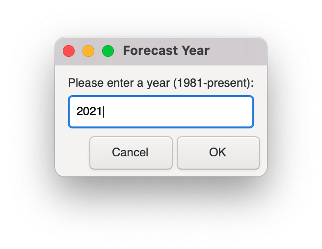
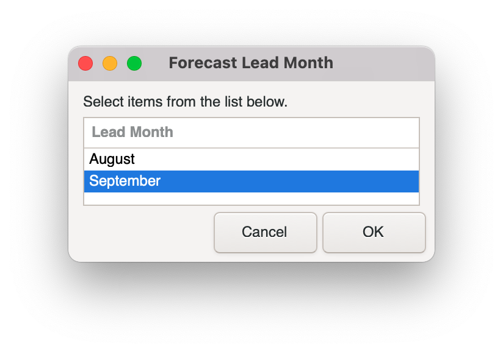
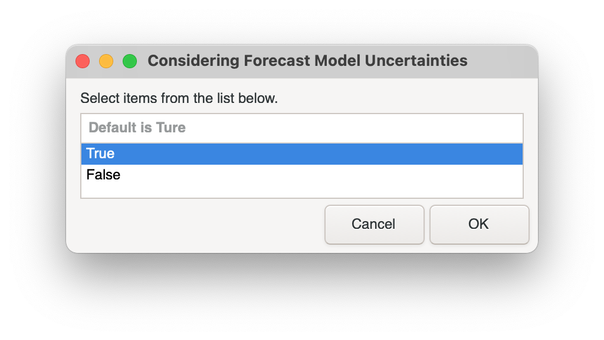
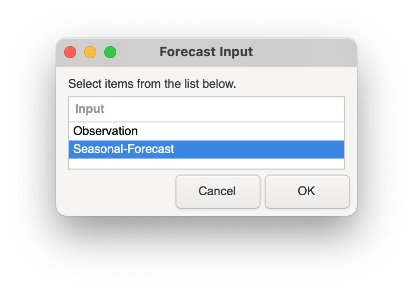
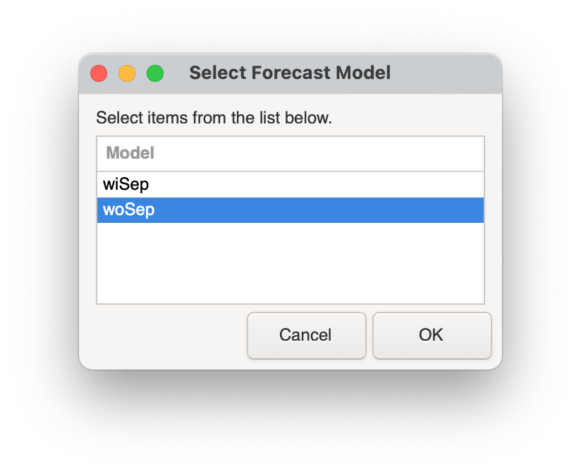
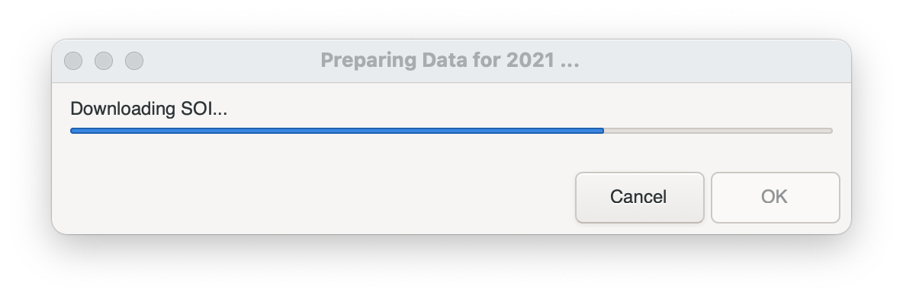
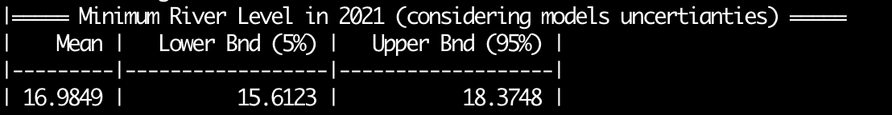

# PEACFLOW2-Manaus-drought-forecasting
This package is used to investigate annual minimum river level on River Negro over Manaus. It will use a similar structure as [PEACFLOW MANAUS Flood Forecasting](https://github.com/achevuturi/PEACFLOW_Manaus-flood-forecasting/tree/master/Using_Observations).

## Use the package
1. Download the package.
2. Scripts are written in __Bash__ and __Python3__. Following [tools and packages](#tools) are necessary.
3. To run the script: `sh main.sh`    
  3.1 Enter forecasting year:   
      
  3.2 Choose forecasting lead month:    
      
  3.3 Whether to include model uncertainty (True is recommanded):    
      
  3.4 Choose forecasting input:    
      
  3.4.2 For *Seasonal-Forecast* only, if *lead-month = August*, then a model-ensemble need to be specified.
    - *wiSep*: Include September rainfall forecast.
    - *woSep*: Exclude September rainfall forecast.    
      
  3.5 Downloading input data:    
      
  3.6 Forecasting minimum river level with the uncertainty range:    
       
  3.7 Investigating the probability under a customised threshold:    
  

## Input Data and other scripts
### Constant data
* Monthly rainfall mask for CHIPRS: `mask_chirps_???.npz`
* Monthly rainfall mask for ECMWF seasonal forecast: `mask_chirps2ec_???.npz`
* Statistical Forecast Model ensemble: `forecast_model_w?Sep.pickle`
* Data for ECMWF rainfall bias correction: `rainfall_bias_correction*.npz`
* Data for investigating forecast models uncertainty: `models_uncertainty_w?Sep.npz`
### Data to be prepared
* CHIRPS monthly rainfall.
* ECMWF monhtly rainfall forecast.
* Prepending maximum river level over Manaus.
* Circulation indies: AMO, IPO, SOI.
* ECMWF monthly sea surface temperature forecast.
### Other scripts

## Required Tools and Packages
### Data Processing Tools
* [Climate Data Operators (CDO)](https://code.mpimet.mpg.de/projects/cdo/wiki)
  * More details can be found on its wiki page, Section: __Installation and Supported Platforms__.
### Shell unitilities
* [Zenity](https://help.gnome.org/users/zenity/stable/) to generate diaglog box in command-line and shell scripts.
  * For Mac, a [Homebrew Formulae](https://formulae.brew.sh/formula/zenity) is available.
  * For Windows, a [GitHub repository](https://github.com/kvaps/zenity-windows) is available.
### Python packages
* [cf python package](https://ncas-cms.github.io/cf-python/)
  * Installation details are available [here](https://ncas-cms.github.io/cf-python/installation.html). 
* [ECMWF/cdsapi package](https://github.com/ecmwf/cdsapi) for data download.
* Other common used packages inlcuding: numpy, pickle, sys.
